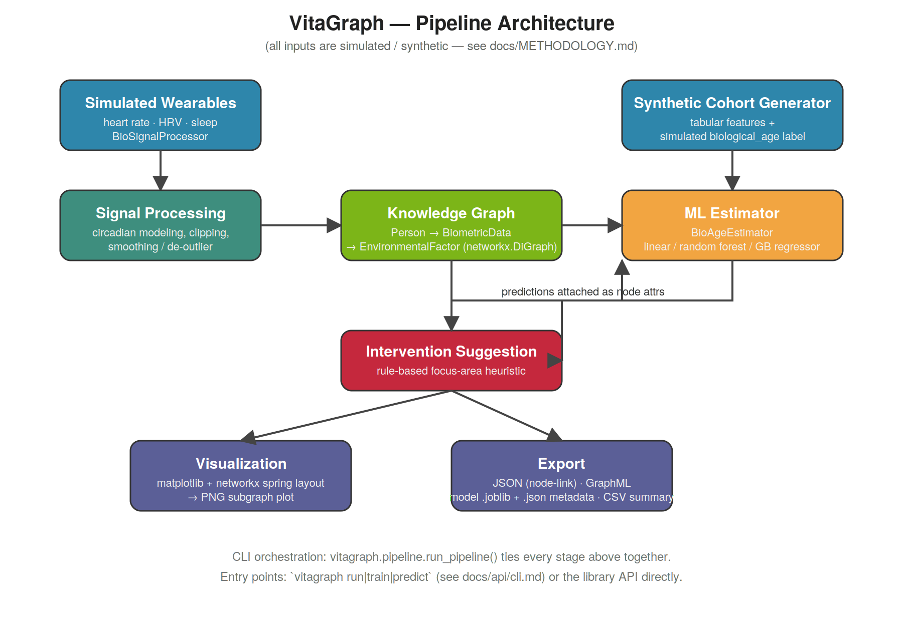

# VitaGraph: Decentralized Bio-Signal Knowledge Graph for Longevity & Precision Medicine


---


[](https://github.com/Ciprian-LocalPulse/vitagraph/actions/workflows/ci.yml)
[](https://github.com/Ciprian-LocalPulse/vitagraph/actions/workflows/codeql.yml)
[](https://ciprian-localpulse.github.io/vitagraph/)
[](https://codecov.io/gh/Ciprian-LocalPulse/vitagraph)
[](https://github.com/astral-sh/ruff)
[](https://github.com/psf/black)
[](#-releases--versioning)
[](#-releases--versioning)
[](#-citation)
[](DONATE.md)
[](https://github.com/Ciprian-LocalPulse/vitagraph)

<sub>This project has not yet published a `v0.2.0` release: the PyPI, Downloads, and DOI badges above intentionally point to the in-repo [Releases](#-releases--versioning) and [Citation](#-citation) sections rather than to `pypi.org`, `pepy.tech`, or `doi.org` — those external pages will 404 until the first tagged release is published and Zenodo archiving runs (see those sections for the exact trigger). CI/CodeQL/Docs/coverage badges are live against this repository right now.</sub>

---

## ⚠️ Important Disclaimer

**VitaGraph is a research reference implementation using entirely synthetic, seeded random data.** Nothing in this repository should be used for real medical, diagnostic, clinical, or therapeutic decision-making. The biological-age predictions produced by this system have not been validated against any clinical cohort and do not represent real biological age or health status.

For research context and future roadmap, see [docs/METHODOLOGY.md](docs/METHODOLOGY.md) and [docs/ROADMAP.md](docs/ROADMAP.md).

---

## 🔬 Project Overview

VitaGraph is an open-source reference framework for simulating and studying the integration of multi-source biometric data using knowledge graphs and machine learning. It demonstrates:

- **Synthetic biometric time-series generation** (heart rate, HRV, sleep, environmental exposure) with circadian and noise patterns
- **Knowledge-graph representation** of person–data–environment relationships using `networkx`
- **Graph-neural-network-inspired** biological-age regression on synthetic labels
- **Pluggable model backends** (linear, random forest, gradient boosting)
- **Full pipeline orchestration** from data simulation through model evaluation
- **CLI and library API** for research / educational workflows

The code is intentionally transparent and modular, designed for researchers and educators to understand every step, audit assumptions, and extend the framework.

---

## 📦 Installation

### From source (development)

```bash
git clone https://github.com/Ciprian-LocalPulse/vitagraph.git
cd vitagraph
pip install -e ".[dev]"
```

### Production install

```bash
pip install vitagraph
```

### Requirements

- Python 3.10+
- Dependencies: `numpy`, `pandas`, `networkx`, `scikit-learn`, `joblib`, `matplotlib`
- Development (`pip install -e ".[dev]"`): `pytest`, `pytest-cov`, `ruff`, `black`, `mypy`, `pre-commit`
- Documentation (`pip install -e ".[docs]"`): `mkdocs-material`, `mkdocstrings[python]`

---

## 🚀 Quick Start

### Run the full pipeline

```bash
vitagraph run --individuals 5 --days 30 --output-dir ./outputs
```

This will:
1. Simulate 5 synthetic individuals' biometric time series (30 days each)
2. Build a knowledge graph connecting person → biometric data → environmental factors
3. Train a gradient-boosting biological-age estimator
4. Cross-validate and evaluate on a held-out split
5. Predict biological age for each simulated person
6. Attach rule-based Intervention recommendations to the graph
7. Export model, graph (JSON + GraphML), and a summary CSV

### Train a model independently

```bash
vitagraph train --samples 1000 --model random_forest --output models/bio_age.joblib
```

### Make a prediction using a saved model

```bash
vitagraph predict \
  --model-path models/bio_age.joblib \
  --chronological-age 40 \
  --heart-rate 72 \
  --hrv 50 \
  --sleep-hours 7 \
  --activity-level 0.6 \
  --environmental-exposure 0.3
```

---

## 🏛️ Architecture



Wearables → Signal Processing → Knowledge Graph → ML Estimator → Visualization → Export.
Full stage-by-module breakdown, design principles, and the editable
`.drawio` source: **[docs/architecture.md](docs/architecture.md)**.

---

## 🐳 Docker

```bash
# Build and run the full pipeline in a container
docker compose up vitagraph

# Or serve the documentation site locally at http://localhost:8000
docker compose --profile docs up docs
```

Equivalent plain-Docker usage:

```bash
docker build -t vitagraph .
docker run --rm -v "$(pwd)/outputs:/home/vitagraph/outputs" vitagraph run --individuals 5
```

---

## 📓 Notebooks & Examples

- **Notebooks** ([`notebooks/`](notebooks/)): `Tutorial.ipynb` (guided walkthrough),
  `Research.ipynb` (cross-validation, learning curves, seed sensitivity),
  `Examples.ipynb` (notebook mirror of the scripts below).
- **Scripts** ([`examples/`](examples/)): `generate_dataset.py`, `train_model.py`,
  `visualize_graph.py`, `cli_demo.py` — each independently runnable, see
  [`examples/README.md`](examples/README.md).
- **Benchmarks** ([`benchmarks/`](benchmarks/)): performance harness for every
  pipeline stage, see [`benchmarks/README.md`](benchmarks/README.md).

---

## 📚 Library API

### Synthetic Data Generation

```python
from vitagraph import SyntheticCohortGenerator

gen = SyntheticCohortGenerator(seed=42)
cohort = gen.generate(num_samples=500)  # Returns DataFrame with features + biological_age label
```

### Signal Processing

```python
from vitagraph import BioSignalProcessor
from datetime import datetime

processor = BioSignalProcessor(seed=42)
hr = processor.generate_synthetic_heart_rate(
    num_samples=100,
    start_time=datetime(2026, 1, 1, 8, 0, 0)
)
# Lightly process (smooth + de-outlier)
hr_processed = processor.process_biometric_data(hr, "heart_rate", window=5)
```

### Knowledge Graph

```python
from vitagraph import KnowledgeGraph

kg = KnowledgeGraph()
kg.add_person_node("P001")
kg.build_from_processed_data("P001", hr_processed, sleep_processed, hrv_processed)

# Export
kg.export_to_json("graph.json")
kg.export_to_graphml("graph.graphml")

# Query
subgraph = kg.get_subgraph_for_person("P001")
info = kg.get_graph_info()  # Summary statistics
```

### Biological-Age Estimation

```python
from vitagraph import BioAgeEstimator
from sklearn.model_selection import train_test_split

estimator = BioAgeEstimator(model_type="gradient_boosting")

X, y = cohort[FEATURE_COLUMNS], cohort["biological_age"]
X_train, X_test, y_train, y_test = train_test_split(X, y, test_size=0.2)

estimator.train(X_train, y_train)
metrics = estimator.evaluate(X_test, y_test)  # MAE, RMSE, R²
cv_scores = estimator.cross_validate(X, y, cv=5)
importance = estimator.feature_importance()

estimator.save_model("bio_age_model.joblib")  # + .json metadata sidecar
estimator.load_model("bio_age_model.joblib")

preds = estimator.predict(X_test)
```

### Full Pipeline

```python
from vitagraph.pipeline import run_pipeline
from vitagraph.config import PipelineDefaults

config = PipelineDefaults(
    num_individuals=5,
    num_sleep_days=30,
    training_samples=500,
    model_type="gradient_boosting",
    cv_folds=5,
)

result = run_pipeline(config=config, output_dir="./outputs")

print(result.individuals)  # Predictions + age gaps
print(result.test_metrics)
print(result.knowledge_graph.get_graph_info())
```

---

## 🏗️ Repository Structure

```
vitagraph/
├── .github/
│   ├── workflows/
│   │   ├── ci.yml                    # lint + typecheck + tests (3 OS x 3 py) + build
│   │   ├── codeql.yml                # CodeQL security scanning
│   │   ├── dependency-review.yml     # Dependency review on PRs
│   │   ├── release.yml               # Tag-triggered PyPI publish + GitHub Release
│   │   └── docs.yml                  # MkDocs build + GitHub Pages deploy
│   └── dependabot.yml                 # Automated dependency + Actions updates
├── src/vitagraph/
│   ├── __init__.py
│   ├── config.py                    # Centralized configuration (baselines, defaults)
│   ├── exceptions.py                # Custom exception types
│   ├── logging_config.py            # Logger factory
│   ├── synthetic_data.py            # SyntheticCohortGenerator
│   ├── bio_signal_processor.py      # BioSignalProcessor (generation + processing)
│   ├── knowledge_graph.py           # KnowledgeGraph class
│   ├── bio_age_estimator.py         # BioAgeEstimator (pluggable models)
│   ├── visualization.py             # Graph plotting (matplotlib)
│   ├── pipeline.py                  # run_pipeline() orchestration
│   └── cli.py                       # argparse CLI entry point
├── tests/
│   ├── conftest.py                  # pytest fixtures
│   ├── test_synthetic_data.py
│   ├── test_bio_signal_processor.py
│   ├── test_knowledge_graph.py
│   ├── test_bio_age_estimator.py
│   └── test_pipeline.py
├── examples/                        # Runnable, independent example scripts
│   ├── generate_dataset.py
│   ├── train_model.py
│   ├── visualize_graph.py
│   └── cli_demo.py
├── notebooks/                        # Jupyter notebooks (executed, outputs committed)
│   ├── Tutorial.ipynb
│   ├── Research.ipynb
│   └── Examples.ipynb
├── benchmarks/                       # Performance benchmark harness
│   ├── bench_pipeline.py
│   └── README.md
├── docs/
│   ├── index.md                     # MkDocs homepage
│   ├── METHODOLOGY.md               # Research scope & methods
│   ├── ROADMAP.md                   # Future objectives (causal inference, GNNs, etc.)
│   ├── architecture.md              # Architecture overview + diagram
│   ├── architecture/
│   │   ├── architecture.svg
│   │   ├── architecture.png
│   │   └── architecture.drawio      # Editable source (app.diagrams.net)
│   ├── whitepaper/
│   │   └── VitaGraph_White_Paper.md # Full research white paper (also as PDF)
│   └── api/                         # mkdocstrings-generated API reference pages
├── data/                            # Place for sample anonymized datasets (DVC-tracked, see data/README.md)
├── models/                          # Trained model artifacts (not versioned)
├── mkdocs.yml                        # Documentation site config (MkDocs Material)
├── Dockerfile                        # Multi-stage build for the CLI/pipeline
├── docker-compose.yml                 # `vitagraph` + `docs` services
├── .pre-commit-config.yaml            # ruff, black, mypy, gitleaks, hygiene hooks
├── CITATION.cff                       # Machine-readable citation metadata
├── .zenodo.json                       # Zenodo archiving / DOI metadata
├── SECURITY.md                        # Vulnerability disclosure policy
├── CODE_OF_CONDUCT.md                 # Contributor Covenant v2.1
├── pyproject.toml                   # PEP 517/518 build config
├── requirements.txt                 # Runtime dependencies
├── requirements-dev.txt             # Development dependencies
├── LICENSE                          # MIT
├── README.md                        # This file
├── CHANGELOG.md                     # Version history
└── CONTRIBUTING.md                  # Contribution guidelines
```

---

## 🧪 Testing

Run the full test suite:

```bash
pytest tests/ -v --cov=vitagraph
```

Run a specific test file:

```bash
pytest tests/test_bio_age_estimator.py -v
```

Generate a coverage report:

```bash
pytest tests/ --cov=vitagraph --cov-report=html
open htmlcov/index.html
```

---

## 🎯 Core Features

### 1. Synthetic Data Generation
- Reproducible, seeded random cohorts with realistic-shaped features
- Configurable population baselines (HR, HRV, sleep, activity, environmental exposure)
- Documented, deterministic biological-age label generation for supervised learning

### 2. Signal Processing
- Circadian-pattern simulation (heart rate dips overnight)
- Rolling-window smoothing (de-noising)
- Z-score-based outlier clipping
- Does not assume stationarity; suitable for short windows or irregular sampling

### 3. Knowledge Graph Construction
- **Node types**: Person, BiometricData, EnvironmentalFactor, Intervention
- **Edge relations**: HAS_DATA, EXPOSED_TO, HAS_RECOMMENDATION
- **Export formats**: JSON (networkx node-link), GraphML (Gephi/Cytoscape compatible)
- **Querying**: Per-person subgraph retrieval, type and relation filtering

### 4. Biological-Age Regression
- **Model backends**: Linear, Random Forest, Gradient Boosting (pluggable)
- **Metrics**: MAE, RMSE, R², cross-validation, feature importance
- **Persistence**: joblib model serialization + JSON metadata sidecar
- **Validation**: train/test split, k-fold CV, hold-out evaluation

### 5. Rule-Based Intervention Logic
- **Simple heuristic**: identifies the feature with the largest unfavorable deviation from population baseline
- **Not causal**: this is explicitly NOT the output of a causal-inference model
- **Future work**: see docs/ROADMAP.md for GNN + causal objectives

---

## 📖 Documentation

- **[Documentation site](https://ciprian-localpulse.github.io/vitagraph/)** (MkDocs Material, auto-deployed from `main`)
- **[docs/METHODOLOGY.md](docs/METHODOLOGY.md)**: What VitaGraph does and does not do; research scope; privacy & ethical considerations
- **[docs/ROADMAP.md](docs/ROADMAP.md)**: Near-term and long-term research objectives; Graph Neural Networks; causal inference
- **[docs/architecture.md](docs/architecture.md)**: Pipeline architecture diagram + stage-by-module mapping
- **[docs/api/](docs/api/)**: Per-module API reference (auto-generated from docstrings via mkdocstrings)
- **[docs/whitepaper/](docs/whitepaper/)**: Full research white paper (Markdown + PDF)
- **[CONTRIBUTING.md](CONTRIBUTING.md)**: How to report issues, submit PRs, and contribute
- **[CODE_OF_CONDUCT.md](CODE_OF_CONDUCT.md)**: Community standards (Contributor Covenant v2.1)
- **[SECURITY.md](SECURITY.md)**: Vulnerability disclosure policy and supported versions

---

## ✅ Code Quality & CI/CD

| Tool | Purpose | Config |
| --- | --- | --- |
| **GitHub Actions CI** | Lint, type-check, test (3 OS × 3 Python versions), CLI smoke test, build | [`.github/workflows/ci.yml`](.github/workflows/ci.yml) |
| **CodeQL** | Static security analysis on every push/PR + weekly schedule | [`.github/workflows/codeql.yml`](.github/workflows/codeql.yml) |
| **Dependabot** | Automated dependency + GitHub Actions update PRs | [`.github/dependabot.yml`](.github/dependabot.yml) |
| **Dependency Review** | Flags newly introduced vulnerable/incompatible dependencies on PRs | [`.github/workflows/dependency-review.yml`](.github/workflows/dependency-review.yml) |
| **Ruff** | Fast linting (`E, F, I, UP, B, SIM` rule sets) | [`pyproject.toml`](pyproject.toml) |
| **Black** | Opinionated formatting, 100-char lines | [`pyproject.toml`](pyproject.toml) |
| **Mypy** | Static type checking of `src/vitagraph` | [`pyproject.toml`](pyproject.toml) |
| **pre-commit** | Runs ruff/black/mypy/gitleaks + hygiene checks locally, pre-push | [`.pre-commit-config.yaml`](.pre-commit-config.yaml) |
| **pytest + pytest-cov** | Unit tests with coverage reporting (Codecov) | [`pyproject.toml`](pyproject.toml) |

Set up pre-commit locally:

```bash
pip install pre-commit
pre-commit install
pre-commit run --all-files
```

---

## 📦 Releases & Versioning

VitaGraph follows [Semantic Versioning](https://semver.org/). Releases are
cut by pushing a `vX.Y.Z` tag, which triggers
[`.github/workflows/release.yml`](.github/workflows/release.yml) to:

1. Build the sdist/wheel and verify the tag matches `pyproject.toml`'s version.
2. Publish to PyPI via [trusted publishing](https://docs.pypi.org/trusted-publishers/) (no long-lived API tokens).
3. Create a GitHub Release with the matching [`CHANGELOG.md`](CHANGELOG.md) section and attached artifacts.
4. If [Zenodo–GitHub integration](https://zenodo.org/account/settings/github/) is enabled for this repo (see [`.zenodo.json`](.zenodo.json)), Zenodo automatically archives the release and mints a DOI.

---

## 🔗 Citation

If you use VitaGraph in your research or teaching, please cite it. Machine-readable
metadata lives in [`CITATION.cff`](CITATION.cff) (used by GitHub's "Cite this
repository" button and tools like Zotero); the BibTeX below is the same
reference in a more portable format:

```bibtex
@software{plesca2026vitagraph,
  author = {Plesca, Ciprian Stefan},
  title  = {VitaGraph: Synthetic-data reference framework for bio-signal knowledge graphs and biological-age estimation},
  year   = {2026},
  url    = {https://github.com/Ciprian-LocalPulse/vitagraph},
  note   = {Open-source research reference implementation, MIT License}
}
```

Once this repository is archived on Zenodo (via the
[GitHub–Zenodo integration](https://zenodo.org/account/settings/github/),
metadata in [`.zenodo.json`](.zenodo.json)), a Concept DOI will be minted
and added here and to `CITATION.cff` — citing the DOI is preferred once
available, since it resolves to an immutable, versioned archive rather
than a mutable Git ref.

---

## 📄 License

VitaGraph is released under the **MIT License**. See [LICENSE](LICENSE) for details.

---

## 💝 Support VitaGraph Research

VitaGraph is an **open-source initiative** sustained by the research community. Your support directly funds:

- 🖥️ **Infrastructure**: Cloud hosting for data processing and model training
- 📊 **Data Quality**: Cleaning, annotation, and validation of biological datasets
- 🤖 **Model Development**: GPU compute for training advanced AI models
- 📚 **Open Science**: Publishing research freely and keeping knowledge accessible
- 🌍 **Community**: Supporting researchers and educators worldwide

### 🎁 Donate Now

**Choose your method:**

| Method | Speed | Privacy |
|--------|-------|---------|
| 🪙 [**Cryptocurrency**](DONATE.md#-cryptocurrency-fast--transparent) | Instant | Pseudonymous |
| 🏦 [**Bank Transfer**](DONATE.md#-bank-transfers-wise) | 1-3 days | Transparent |

➡️ **[Full Donation Guide →](DONATE.md)** (EUR, USD, GBP, RON, BTC, ETH)

Every contribution—from €5 to €1000+—makes a difference. **All donations directly fund research.**

---

## 🤝 Contributing

We welcome contributions! Please see [CONTRIBUTING.md](CONTRIBUTING.md) for:
- How to report bugs or request features
- Code style and testing requirements
- Pull request workflow
- Recognition in the contributors list

All participants are expected to follow the [Code of Conduct](CODE_OF_CONDUCT.md).

---

## ❤️ Ways to Support

- **Donate**: [Support VitaGraph Research →](DONATE.md)
- **GitHub Stars**: ⭐ Star us on GitHub
- **Issues & PRs**: Report bugs, suggest features, or contribute code
- **Cite our work**: Use the BibTeX above in your papers
- **Spread the word**: Share with colleagues, communities, and social media

---

## 👨‍💼 Author

**Ciprian Stefan Plesca**  
GitHub: [@Ciprian-LocalPulse](https://github.com/Ciprian-LocalPulse)

---

## 🌟 Sponsors & Partners

VitaGraph is supported by generous donors and research partners. **[View sponsors →](SPONSORS.md)** | **[Become a sponsor →](DONATE.md)**

---

**Made for Research** | *Funded by the Research Community*
